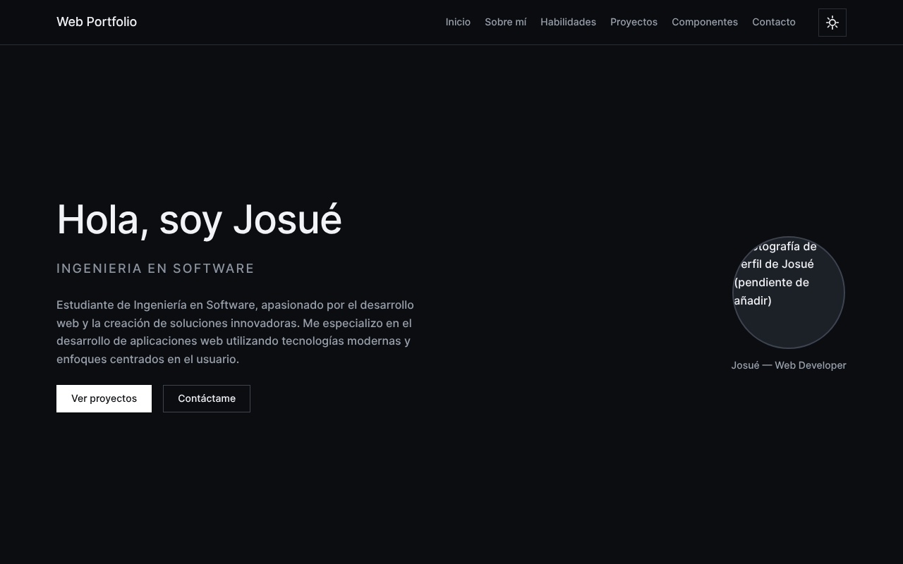
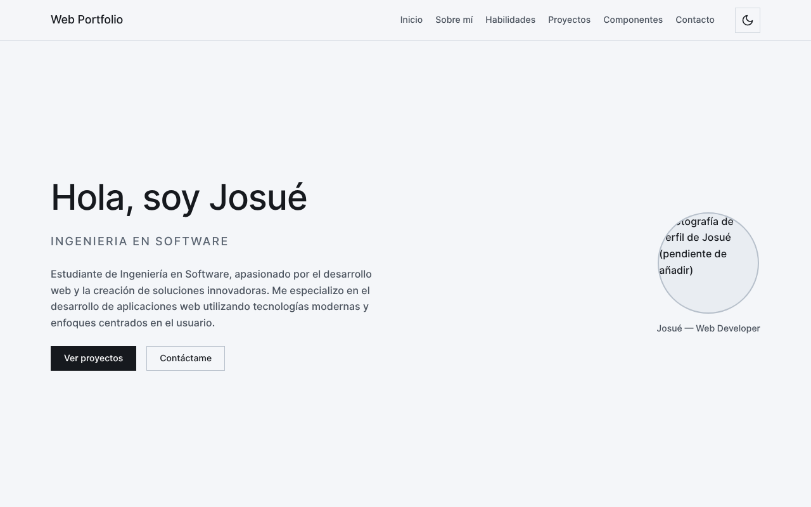
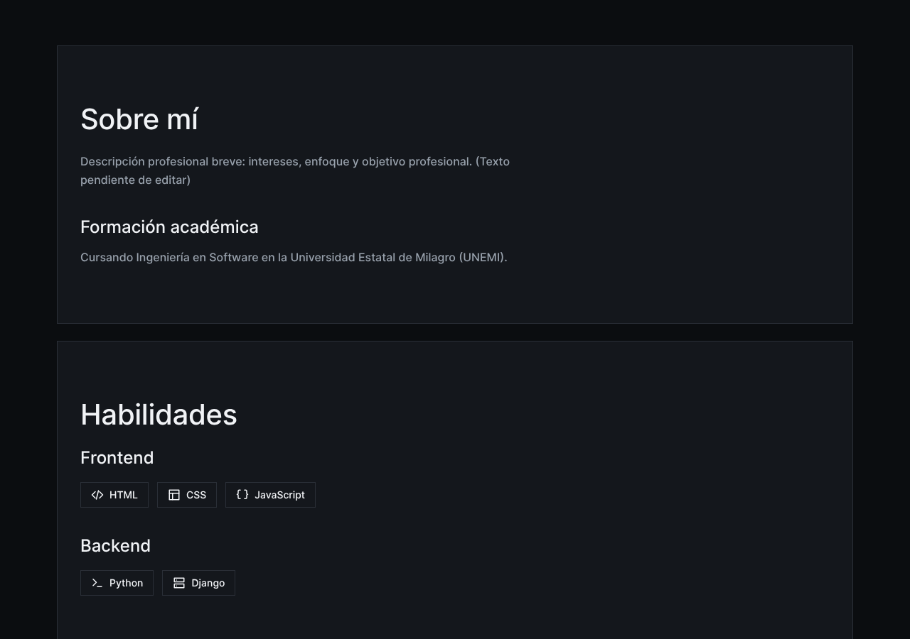
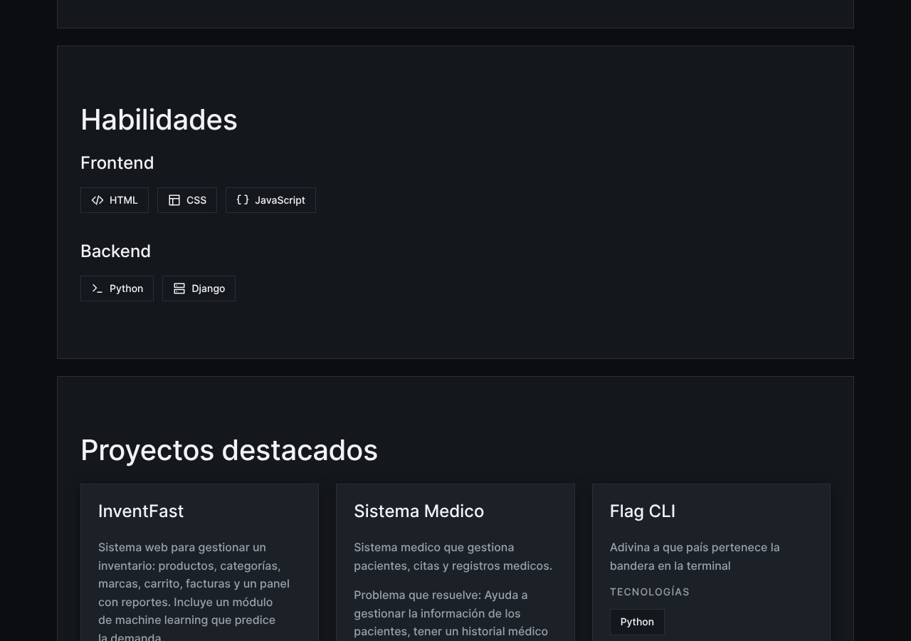
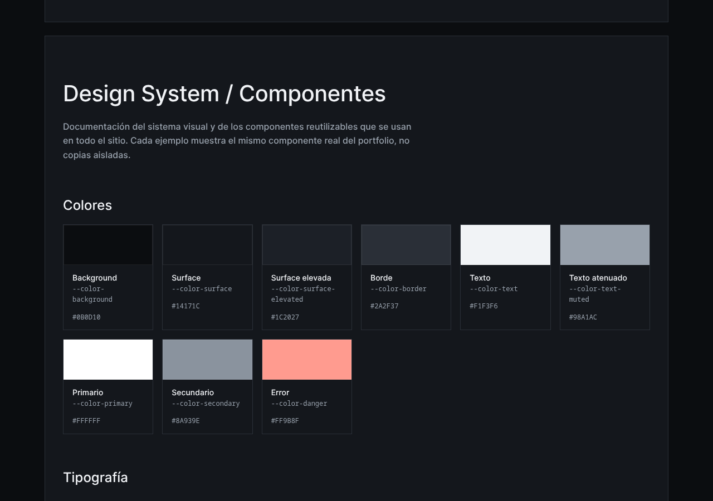
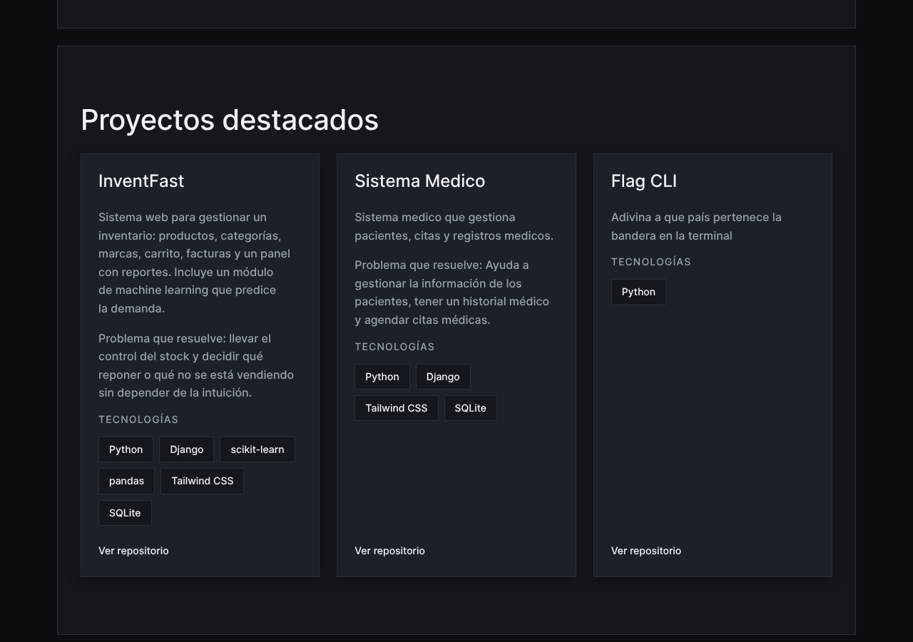
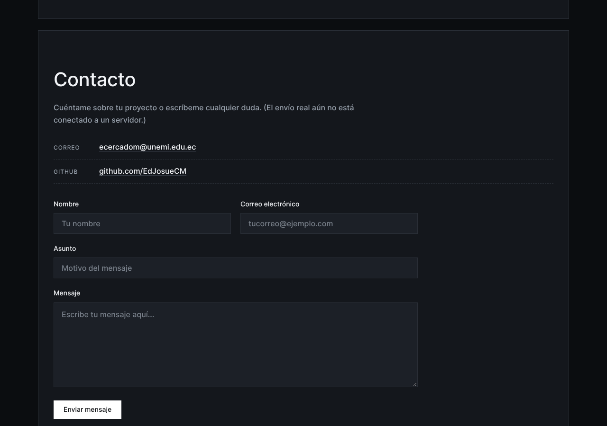
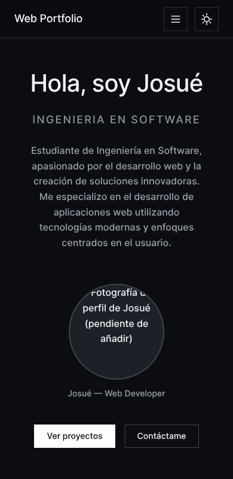
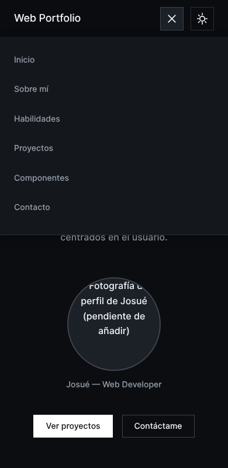

# Portafolio web

Mi portafolio personal. Es un sitio de una sola página donde presento quién soy, las tecnologías que uso y algunos de mis proyectos, con una sección aparte que documenta el sistema de diseño con el que está construido.

Está hecho con HTML, CSS y JavaScript puros, sin frameworks ni herramientas de compilación.

## Capturas

| Tema oscuro | Tema claro |
| --- | --- |
|  |  |

| Sobre mí | Habilidades |
| --- | --- |
|  |  |







| Móvil | Menú en móvil |
| --- | --- |
|  |  |

## Tecnologías

- HTML5 semántico
- CSS3 con variables personalizadas, Flexbox y Grid
- JavaScript (sin librerías)

## Cómo verlo

No necesita instalación. Descarga o clona el repositorio y abre `index.html` en el navegador.

```
git clone https://github.com/EdJosueCM/web-profile.git
cd web-profile
```

También se puede publicar tal cual con GitHub Pages.

## Estructura

```
index.html
css/styles.css
js/index.js
capturas/
```

## Contacto

- GitHub: [EdJosueCM](https://github.com/EdJosueCM)
- Correo: ecercadom@unemi.edu.ec
